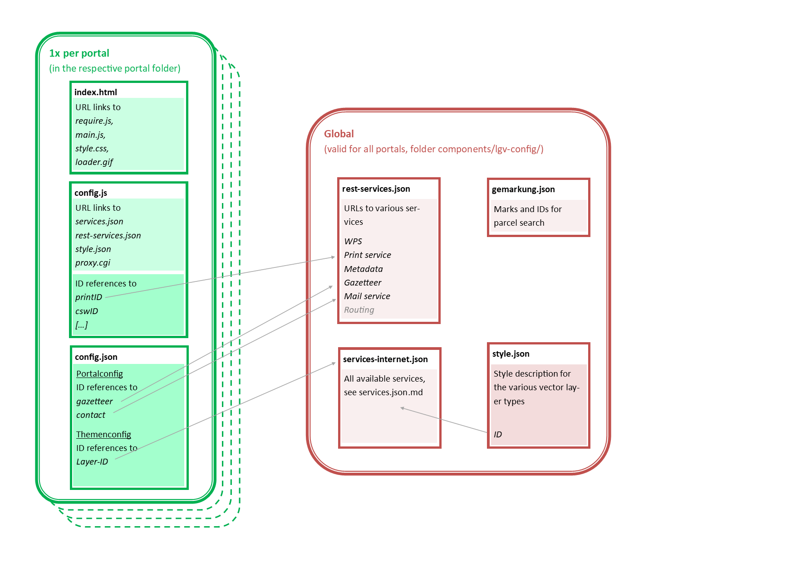

# About the User Documentation
This section of the documentation contains all the information for admins that want to create portals with the
Masterportal software. This site provides an overview of the contents of this part of the documentation.

## Configuration files

The Masterportal builds on global and portal-specific configuration files alike.

### Global configuration files

These files describe central information to be used by multiple portals:

* **[services.json](./Global-Config/services.json.md)**: lists all available layers
* **[rest-services.json](./Global-Config/rest-services.json.md)**: URLs to various external services
* **[style.json](./Global-Config/style.json.md)**: holds style definitions for vector layers

### Portal-specific configuration files

These files define the distinguishing features of an instance:

* **[config.js](./Portal-Config/config.js.md)**: Configuration of paths to further configuration files and services
* **[config.json](./Portal-Config/config.json.md)**: Configuration of portal appearance and available contents

The following figure schematically demonstrates the ensemble of files. Please mind that the files **index.html**, **[config.js](./Portal-Config/config.js.md)**, and **[config.json](./Portal-Config/config.json.md)** must be placed in the same path.

## URL parameters

The Masterportal can be called with **[URL parameters](urlParameter.md)** to e.g. call functions initially or describe a view.

## Proxies

For requesting attribution information via `WMS GetFeatureInfo` and for loading WFS layers, **[proxies](proxies.md)** have to be defined.
